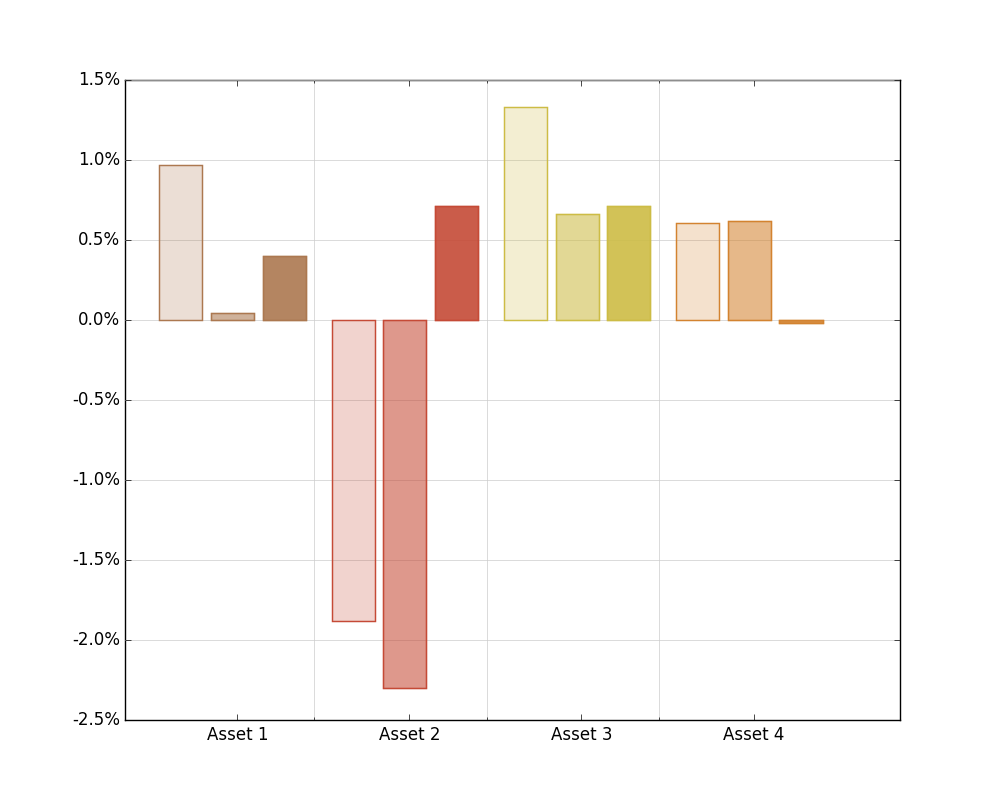
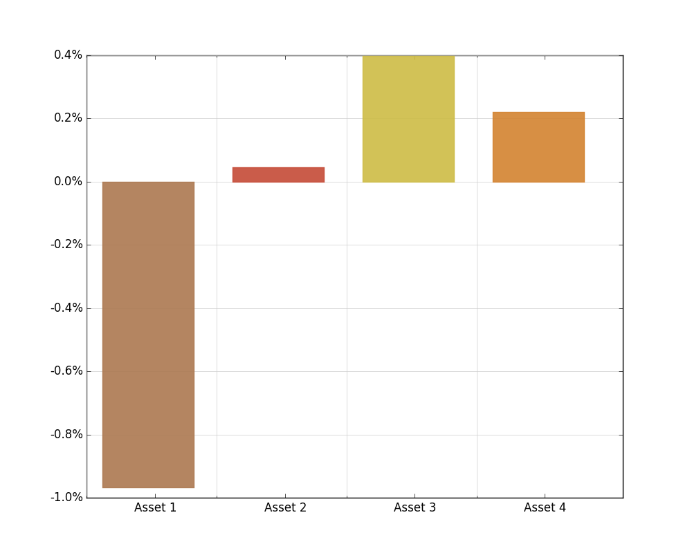
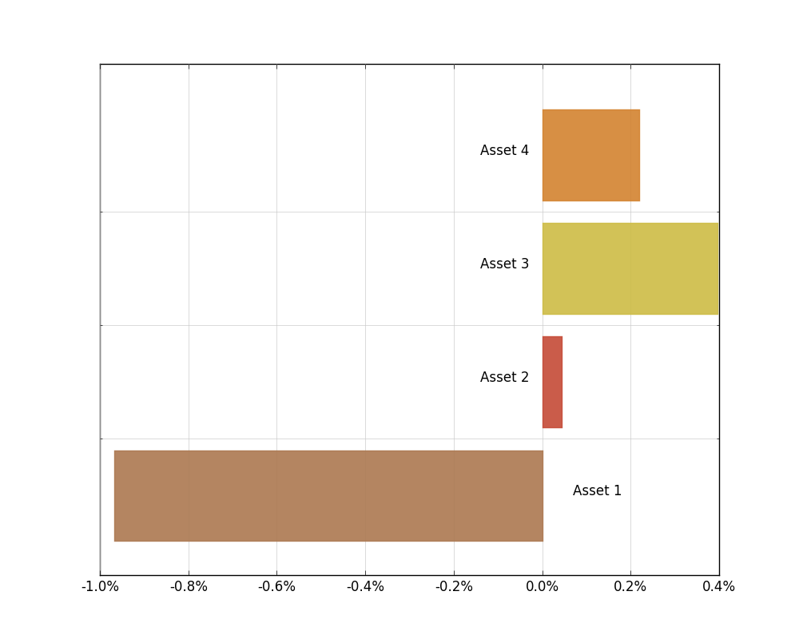

# Pandas-Factorplots-for-Dataframes-and-Series

Functions to create factorplots in matplotlib for Pandas dataframes and series of real numbers. 

A factor plot is simply the same plot generated for different response and factor variables and arranged on a single page. The underlying plot generated can be any univariate or bivariate plot.  This application groups by rows from the dataframe and displays a bar plot of values/percentages per column. 

Parameters to be set include:
 * Colormap
 * Filename
 * Filetype
 * Percentage axis-scale boolean

See below examples using three rows and four categories...


```python
column_fun(df, d1)
```





```python
column_fun(ser, d2)
```





```python
row_fun(ser, d3)
```





```python

```
